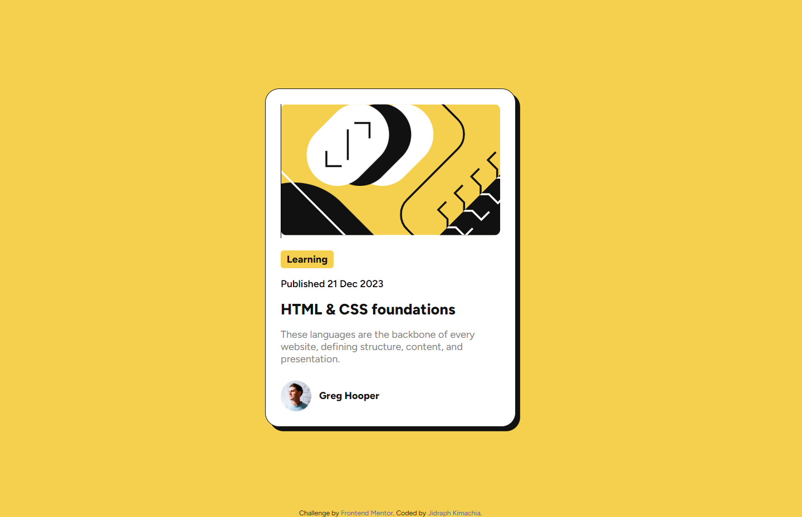

# Frontend Mentor - Blog preview card challenge solution by Jidraph Kimachia

## [Live](https://youngjid.github.io/Frontend-Mentor-Blog-Preview-Card-Challenge-Solution/) | [Solution](https://www.frontendmentor.io/solutions/responsive-blog-preview-card-solution-tXZs9K42on) | [Challenge](https://www.frontendmentor.io/challenges/blog-preview-card-ckPaj01IcS)

Solution for a challenge from [frontendmentor.io](https://www.frontendmentor.io/).

This is a solution to the [QR code component challenge on Frontend Mentor](https://www.frontendmentor.io/challenges/qr-code-component-iux_sIO_H). Frontend Mentor challenges help you improve your coding skills by building realistic projects. 

## Overview

This is a good challenge exercise for beginners in HTML and CSS.

PS: I don't have the Figma File, so the design is not pixel perfect.

### Built with

- Semantic HTML5 markup
- CSS custom properties and variables
- HSLA Colors
- Flexbox
- Mobile Responsive
- HTML Positions

## Author

- Website - [Jidraph Kimachia](https://jidraphkimachia.com)
- Frontend Mentor - [@youngjid](https://www.frontendmentor.io/profile/youngjid)
- LinkedIn - [@jidraphkimachia](https://www.linkedin.com/in/jidraphkimachia/)
- Twitter - [@young_jid](https://twitter.com/young_jid)

## Acknowledgments

A big thank you to anyone providing feedback on my <a href="https://www.frontendmentor.io/solutions/responsive-blog-preview-card-solution-tXZs9K42on">solution</a>. It definitely helps to find new ways to code and find easier solutions! 

- https://www.youtube.com/watch?v=4yiJyHAn9EI - Local Font Installation
- ChatGPT - Mobile Responsive Design

